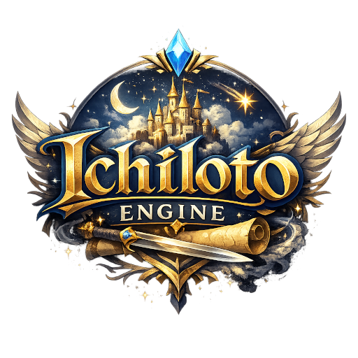

<p align="center">
    
</p>

# Ichiloto 2D Game Engine

**Ichiloto 2D Game Engine** is a PHP-based engine for creating JRPG-style games,
inspired by classics such as *Final Fantasy 1-6* and *Dragon Quest*. Terminal
presentation remains the default. An optional GPUI renderer is under development;
PHP continues to own gameplay, input bindings, animation state and saves.

## Features
- **Terminal worlds:** Styled text, retained-cell rendering, camera scrolling, notifications and HUD overlays.
- **Battle systems:** Traditional turn-based and active-time combat, with configurable battle-entry rules.
- **Game systems:** Maps, events, quests, dialogue, NPCs, inventory, equipment and character progression.
- **Persistence and audio:** Save/load support, music and sound effects; see their runtime requirements below.
- **Optional graphical presentation:** Sprite sheets, field tiles and a locally playtested graphical battle foundation. Native player distribution is not yet available.

## Installation

The PHP package requires PHP **8.4.1 or later** and Composer:

```sh
composer require ichiloto/engine
```

Project scaffolding and launch commands belong to
[Ichiloto Console](https://github.com/ichiloto/console); the editor is a
[separate package](https://github.com/ichiloto/editor).
Installing the PHP package does **not** install a native GPUI executable.
See [audio](docs/audio.md) for sound playback requirements and
[local checks](docs/continuous-integration.md) for contributor setup.

## GPUI Availability

**A clean Engine checkout is not a complete native-player installation.**
`resources/renderers/` contains its [installation README](resources/renderers/README.md).
Native executables and the generated installation manifest are ignored by Git.
There is currently no published renderer package or Console command to install
one. Selecting GPUI cannot provision a missing executable automatically.

Cargo instructions are for developers building the separate
[ichiloto/gpui-renderer](https://github.com/ichiloto/gpui-renderer) repository,
which contains `Cargo.toml`. Do not run them from this Engine repository or its
renderer resources folder. Players should receive compatible, verified platform
packages without installing Rust or build tools; that delivery work is unfinished.

The graphical battle foundation has been playtested on macOS/Apple Silicon.
A subsequent, local and unpublished correction removes the Renderer window's
blanket non-macOS rejection using shared GPUI maximize/restore handling. It has
macOS validation only and is not delivered by pulling Engine. Linux/WSLg remains
untested; WSLg uses Linux PHP and a Linux renderer. Native Windows additionally
needs a correct [process transport](docs/rendering/process-transport.md).
Neither a portable API nor a matching platform identifier establishes complete
platform support.

The [integration roadmap](docs/rendering/integration-roadmap.md) separates accepted
work from remaining animation, effects, graphical UI and platform delivery.

## Project Vocabulary

Runtime menus and battle results read developer-owned display terms from
`vocab` in the project configuration. `currency.name` and `currency.symbol`
apply to balances, purchases, rewards and learning costs in both Terminal and
graphical presentation. An explicitly empty currency symbol is supported.
The `game`, `shop` and `command` groups rename controls; `stats` and `battle`
provide optional stat and battle headings. Omitted terms retain existing defaults.

Locale-specific entries at `vocab.<locale>` override base terms. Maps such as
`command.summon_by_role` merge translated entries with the base map. Full authored
sentences remain in the separate message catalog; vocabulary does not rewrite
story text, stored data keys or gameplay identity.

Battle menus carry `BattleCommand` descriptors with a stable `type` and a
display `name`, replacing the former executable-attack placeholders.
`BattleCommandCatalog::buildOptions()` accepts a `BattleCommandType`; legacy
name/id strings are still accepted at that API boundary. Renaming a command
does not change its targeting, availability, action category or icon role.

## Documentation

- [Continuous integration and local checks](docs/continuous-integration.md)
- [Maps](docs/maps.md), [quests](docs/quests.md) and [story events](docs/story-events.md)
- [Persistence](docs/persistence.md), [save compatibility](docs/save-compatibility.md) and [audio](docs/audio.md)
- [Battle-entry rules](docs/battle-entry-rules.md)
- [Renderer installation boundary](resources/renderers/README.md)
- [Graphical battle foundation and validation](docs/rendering/graphical-battle-g1.md)
- [Sprite sheets](docs/rendering/sprite-sheets.md) and [field tiles](docs/rendering/tile-batches.md)
- [Renderer process transport (S2)](docs/rendering/process-transport.md)
- [Pluggable input sources (S3)](docs/rendering/input-sources.md)
- [Presentation frames and Console snapshots (S4)](docs/rendering/presentation.md)
- [Optional graphical sprite intent and Player projection (S5)](docs/rendering/graphical-sprites.md)
- [Optional Game renderer runtime and project artwork (S6)](docs/rendering/runtime.md)

## Contributing and Git workflow

Read [GIT_WORKFLOW.md](GIT_WORKFLOW.md) and install the Git guards with
`sh scripts/install-git-guards.sh` before contributing. All changes integrate
into `develop`; `main` is updated only by a PR from this repository's `develop`.
